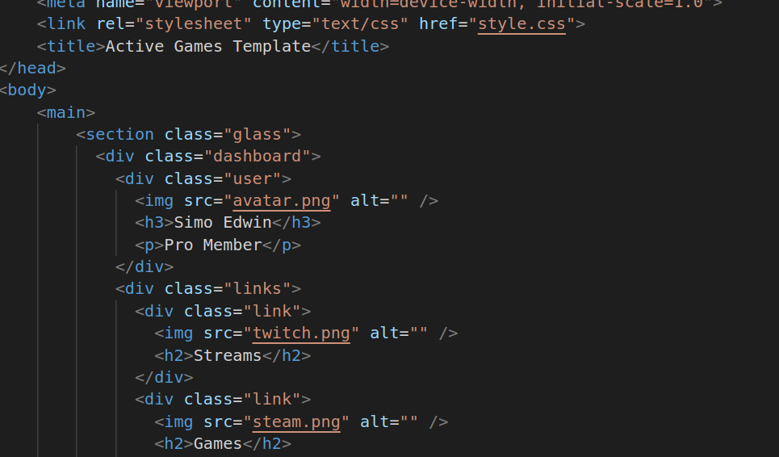
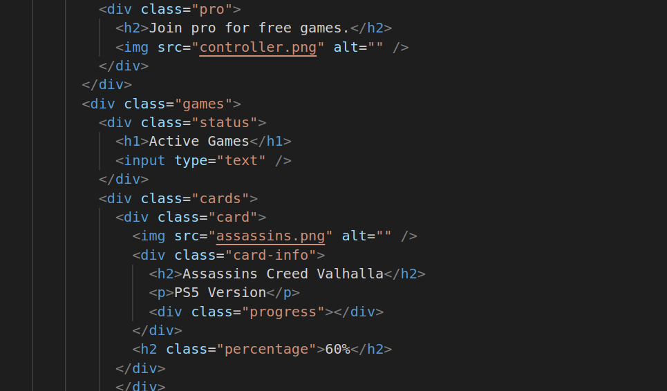
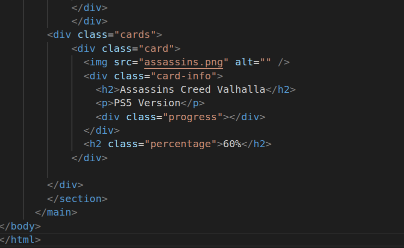
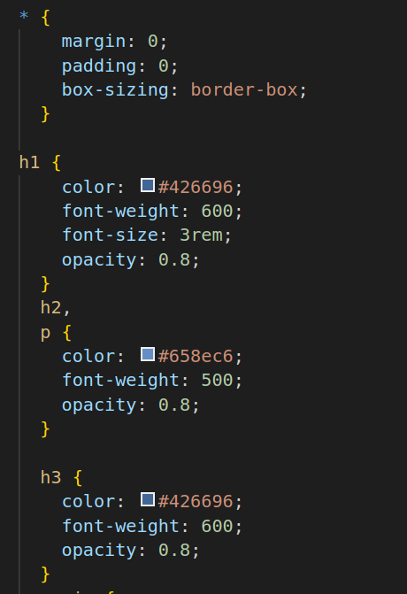
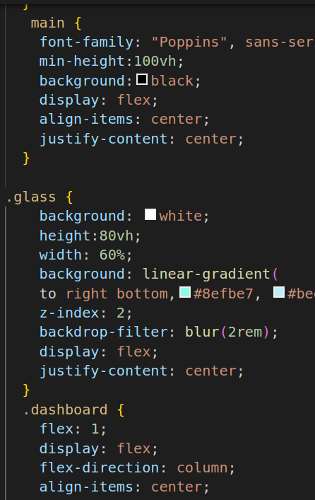
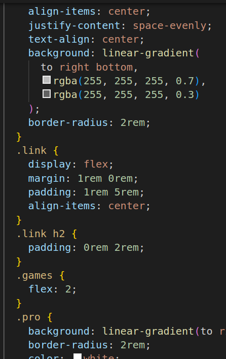
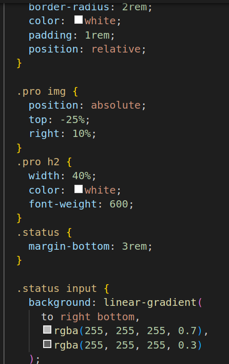
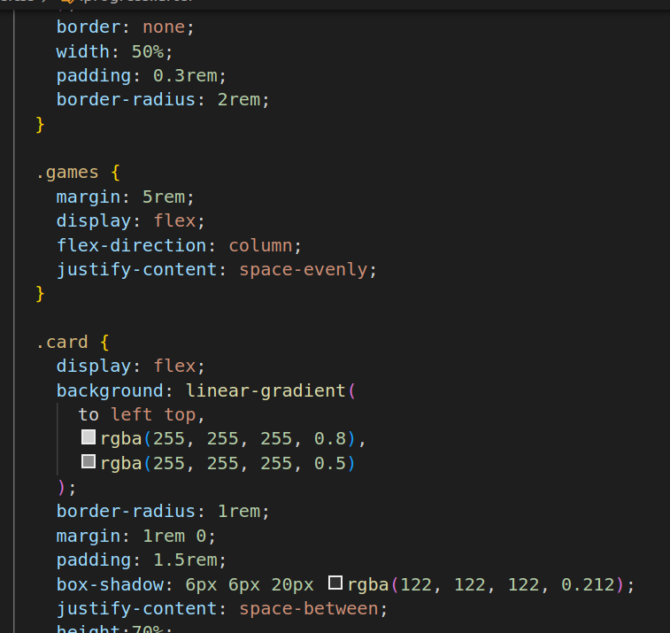
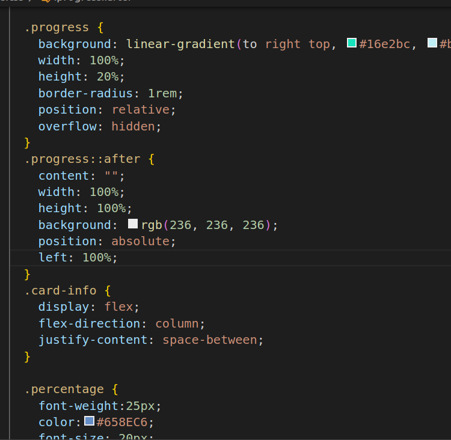

# Active Games Template
1.
* link rel:This is a link to an external stylesheet (style.css) that is used to apply CSS styles to HTML document.
* The main element is a semantic HTML5 element used to represent the main content of a web page. It typically contains the primary content of your page, excluding headers, footers, and sidebars. In your case, it wraps the main content of your "Active Games Template."
* The section element is used to define a section or a thematic grouping of content on a web page. The class attribute is used to apply a CSS class called "glass" to this section, which can be used for styling.
* The div element is a generic container used to group and structure content. In this case, it has a class "dashboard," suggesting that it likely contains information related to a dashboard or control panel.
* These are div elements with specific class names used for structuring and styling different sections within the "dashboard."
* The img element is used to display images on a web page. It has a src attribute that specifies the image file's source and an alt attribute that provides alternative text for accessibility purposes.
* The h3 element is a heading element used to define a third-level heading. It represents a subheading with the text "Simo Edwin."
* The p element is used to define a paragraph of text. In this case, it contains the text "Pro Member."
* These div elements with the class "link" are used to structure links or navigation items within the "dashboard."
* These elements represent an image and a heading (h2) for a link or navigation item.
* This div element with the class "games" is used to structure the section containing active games.

2.

3.

* This div element is used to contain information related to the status of active games.
* The h1 element represents a top-level heading with the text "Active Games."
* The input element is used to create a text input field. Users can enter text in this field.
* These div elements with the class "cards" are used to structure individual card-like sections that likely contain game information.

4.

5.

* *: This is a universal selector, which selects all elements on the page.
margin: 0;, padding: 0: These properties set the margin and padding of all elements to zero, effectively resetting the default spacing.
* box-sizing: border-box: This property ensures that the width and height of an element include both content and padding, but not the border.
* h1: This selects all h1 elements on the page.
* color: #426696: Sets the text color of h1 elements to a specific shade of blue.
* font-weight: 600: Sets the font weight to make the text bold.
* font-size: 3rem: Sets the font size to 3 times the default size.
opacity: 0.8: Sets the opacity of the text to 80%.
* h2, p: This selects all h2 and p elements on the page.
* color: #658ec6: Sets the text color of h2 and p elements to a specific shade of blue.
* font-weight: 500: Sets the font weight to a medium value.
opacity: 0.8;: Sets the opacity of the text to 80%.
* h3: This selects all h3 elements on the page.
* color: #426696: Sets the text color of h3 elements to a specific shade of blue.
* font-weight: 600: Sets the font weight to make the text bold.
opacity: 0.8: Sets the opacity of the text to 80%.
* main: This selects the main element.
font-family: "Poppins", sans-serif: Sets the font family for text inside the main element to "Poppins" or a generic sans-serif font if "Poppins" is unavailable.
* min-height: 100vh: Sets the minimum height of the main element to 100% of the viewport height, ensuring it covers the entire screen.
* background: black: Sets the background color of the main element to black.
* display: flex: Makes the main element a flex container.
* align-items: center: Centers its child elements vertically.
* justify-content: center: Centers its child elements horizontally.
* glass: This selects elements with the class "glass."
* background: white: Sets the background color of elements with the class "glass" to white.
* height: 80vh: Sets the height of elements with the class "glass" to 80% of the viewport height.
* width: 60%: Sets the width of elements with the class "glass" to 60% of its containing element.
* background: linear-gradient(to right bottom, #8efbe7, #beeef6): Applies a linear gradient background with two colors.
* z-index: 2: Sets the stacking order of the element to 2 (used for layering elements).
* backdrop-filter: blur(2rem): Applies a blur effect to the content behind the element.
* display: flex: Makes the element with the class "glass" a flex container.
* justify-content: center: Centers its child elements horizontally.
* flex: 1: This property assigns a flex value of 1 to the .dashboard element, which means it will take up available space and expand vertically.
* display: flex: Makes the .dashboard element a flex container, allowing its children to be flex items.
* flex-direction: column: Sets the direction of the flex container to be a column, so its children are stacked vertically.
* align-items: center: Centers the children horizontally within the container.
* justify-content: space-evenly: Distributes the space evenly between the children, creating equal vertical spacing.
* text-align: center: Centers text content horizontally within the .dashboard element.
* background: Applies a linear gradient background from top-right to bottom-left, creating a fading effect from white to transparent white.
* border-radius: 2rem: Adds rounded corners with a 2rem border radius to the .dashboard element.

6.

7.

8.

9.

* display: flex: Makes the link element a flex container.
* margin: 1rem 0rem: Sets a top and bottom margin of 1rem and no left/right margin, creating vertical spacing.
* padding: 1rem 5rem: Sets padding of 1rem on the top and bottom and 5rem on the left and right, creating space around the content.
* align-items: center: Centers the children horizontally within the .link element.
* lex: 2: This property assigns a flex value of 2 to the .games element, which means it will take up twice as much vertical space compared to other elements within the same container. It helps distribute space effectively.
* background: Applies a linear gradient background from bottom-left to top-right, creating a gradient effect from teal (#65dfc9) to light blue (#6cdbeb).
* border-radius: 2rem: Adds rounded corners with a 2rem border radius to the .pro element.
* color: white: Sets the text color to white.
* padding: 1rem: Adds padding to create space around the content inside the .pro element.
* position: absolute: Makes the image positioned relative to its closest positioned ancestor (.pro in this case).
* top: -25%: Moves the image 25% above its normal position within the .pro container.
* right: 10%: Positions the image 10% from the right edge of its container. This combination of properties is used to create a visual effect where the image appears to be floating above the content.
* width: 40%: Sets the width of the h2 element to 40% of its container, allowing it to take up a portion of the available space.
* color: white: Sets the text color to white.
* font-weight: 600: Specifies a font weight of 600 (semi-bold) for the text.
* margin-bottom: 3rembackground: Applies a linear gradient background to the input  element, creating a gradient effect from top-left to bottom-right with two levels of transparency.
* border: none: Removes the border around the input element.
* width: 50%: Sets the input element's width to 50% of its container.
* padding: 0.3rem: Adds padding to the input element, creating space around its content.
* border-radius: 2rem: Adds rounded corners with a 2rem border radius to the input element.: Adds a bottom margin of 3rem (3 times the size of the default line height) to the .status element, creating spacing between it and the elements below it.
* margin: 5rem;: Adds a margin of 5rem around the .games element, creating spacing between it and other elements.
* display: flex: Makes the .games element a flex container.
* flex-direction: column: Sets the direction of the flex container to be a column, so its children are stacked vertically.
* justify-content: space-evenly: Distributes the vertical space evenly between the children, creating equal spacing.
* display: flex: Makes the .card element a flex container.
* background: Applies a linear gradient background to the card, creating a gradient effect from top-right to bottom-left with two levels of transparency.
* border-radius: 1rem;: Adds rounded corners with a 1rem border radius to the card.
* margin: 1rem 0;: Adds a top and bottom margin of 1rem and no left/right margin to create vertical spacing between cards.
* padding: 1.5rem;: Adds padding to the card, creating space around its content.
box-shadow: Applies a subtle shadow to create a card-like elevation effect.
* justify-content: space-between;: Distributes space evenly between child elements (.progress and .card-info) within the card.
* height: 70%;: Sets the height of the card to occupy 70% of its container's height.
* background: Applies a linear gradient background to the progress bar, creating a gradient effect from top-left to bottom-right with two colors (#16e2bc and #beeef6).
* width: 100%: Sets the width of the progress bar to 100% of its container.
* height: 20%: Sets the height of the progress bar to 20% of its container, creating a horizontal bar.
* border-radius: 1rem: Adds rounded corners with a 1rem border radius to the progress bar.
* position: relative: Positions the progress bar relative to its normal position.
* overflow: hidden: Clips any content that exceeds the boundaries of the progress bar.
* content: "": Adds an empty content pseudo-element.
* width: 100%: Sets the width of the pseudo-element to 100% of its container.
* height: 100%: Sets the height of the pseudo-element to 100% of its container.
background: Sets the background color of the pseudo-element to a light gray color (rgb(236, 236, 236)).
* position: absolute: Positions the pseudo-element relative to its nearest positioned ancestor (.progress in this case).
* left: 100%: Moves the pseudo-element to the right, creating a visual effect for the progress bar.
* display: flex;: Makes the .card-info element a flex container.
* flex-direction: column: Sets the direction of the flex container to be a column, so its children are stacked vertically.
* justify-content: space-between: Distributes the vertical space evenly between the children, creating equal spacing.
* font-weight: 25px: This property seems to be incorrect. font-weight should specify a numeric value (e.g., font-weight: 600; for bold). The px unit is not valid for font-weight.
* color: #658EC6: Sets the text color to a shade of blue (#658EC6).
* font-size: 20px: Sets the font size to 20 pixels for the text within elements with the .percentage class.